# 数据分析报告

Table 1-1-1 RUN信息统计汇总表

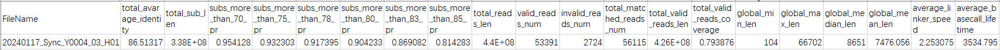

# 目录

1. [准确率相关统计](#准确率相关统计)  
   1.1 [比对统计](#比对统计)  
   1.2 [与读长关系](#与读长关系)  
   1.3 [碱基变异统计](#错误类型统计)  
   1.4 [准确率差异分析](#准确率差异分析)
2. [读长相关统计](#读长相关统计)
3. [速度相关统计](#速度相关统计)
4. [AR相关统计](#AR相关统计)  
   4.1 [与Block Rate的关系](#与Block-Rate的关系)  
   4.2 [AR分布](#AR分布)
5. [DW相关统计](#DW相关统计)  
   5.1 [与Block Rate的关系](#与Block-Rate的关系)  
   5.2 [DW分布](#DW分布)  
6. [Capture Rate相关统计](#Capture-Rate相关统计)  
   6.1 [与Block Rate的关系](#与Block-Rate的关系-1)  
   6.2 [CR分布](#CR分布)
7. [Pore-LT与Basecall-LT相关统计](#Pore-LT与Basecall-LT相关统计)

## 1. 准确率相关统计

### 1.1 准确率分布

Fig 1-4-1 准确率分布直方图

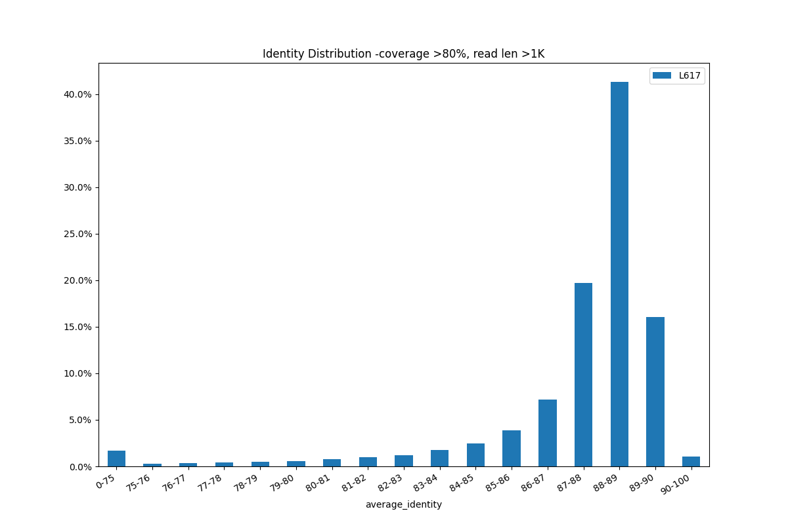

### 1.2 与读长关系 

Fig 1-2-1 Read len与Identity相关性散点图

### 1.3 错误类型统计

Table 1-3-1 错误类型统计汇总表

Fig 1-3-2 错误类型统计汇总图

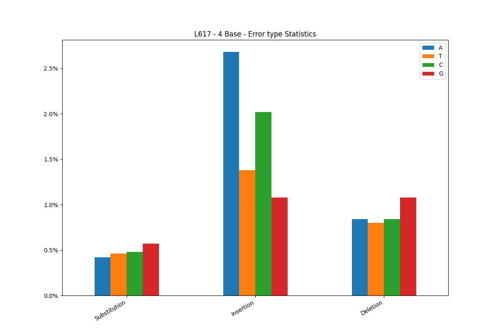

|      |      |
| ---- | ---- |
|Fig 1-3-3 总-错误类型统计|Fig 1-3-4 四种碱基-总错误统计|
|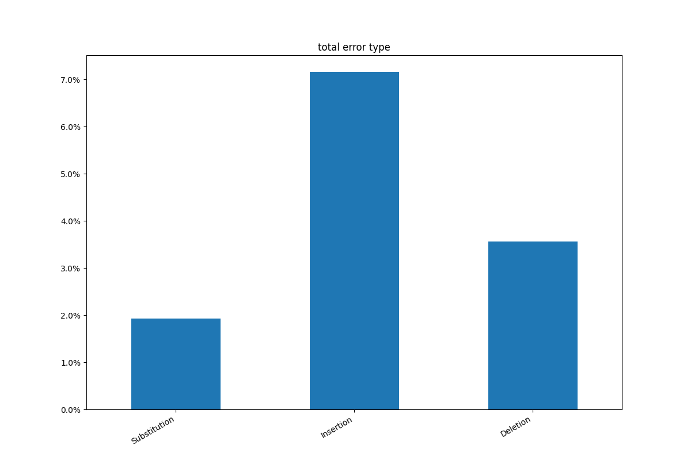| 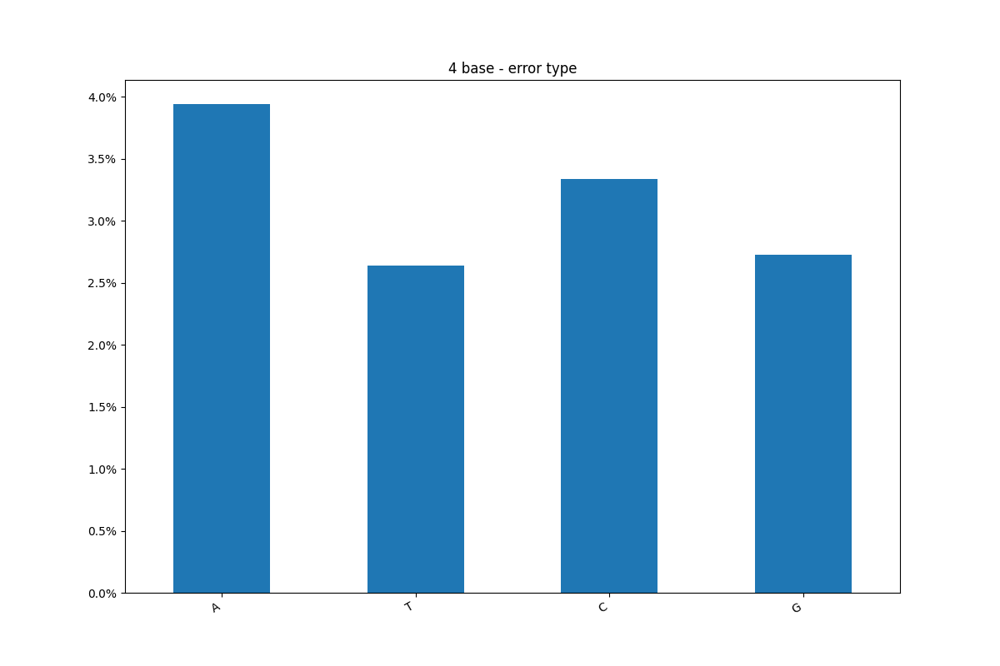 |

## 2. 读长相关统计

Fig 2-1 信号LT>60min 读长分布占比图

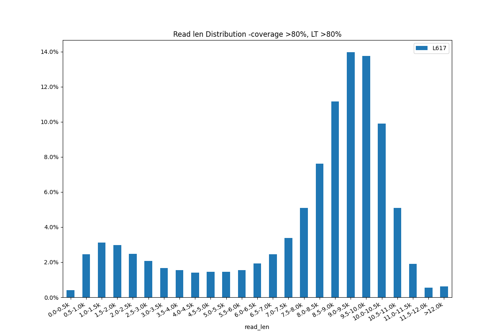

## 3. 速度相关统计

Fig 3-1 信号LT>60min 速度分布占比图

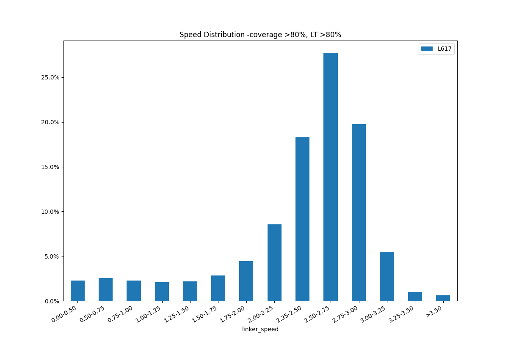

## 4. AR相关统计

### 4.1 与Block Rate的关系

Fig 4-1-1 AR与BR相关性散点图

### 4.2 AR分布

Fig 4-2-1 AR分布条形图

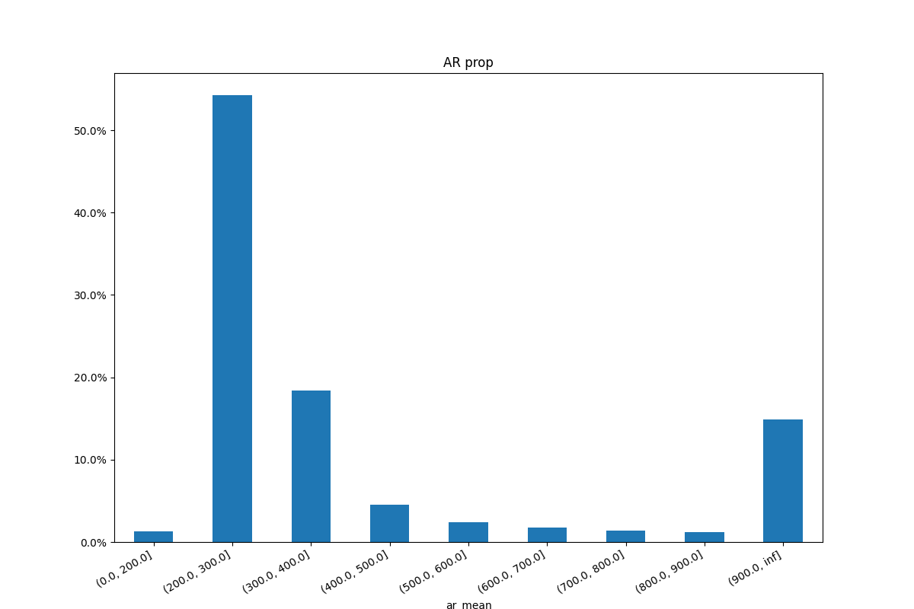

Fig 4-2-2 四种碱基AR占比图

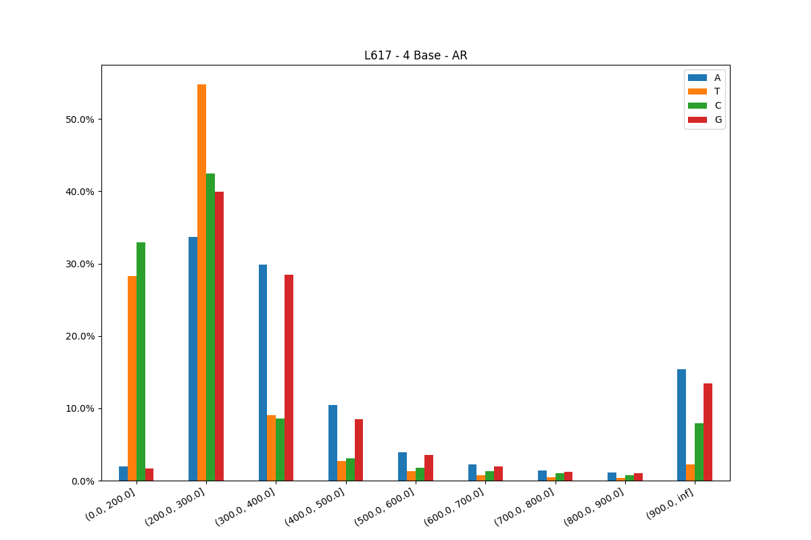

## 5. DW相关统计

### 5.1 与Block Rate的关系

Fig 5-1-1 DW与BR相关性散点图

### 5.2 DW分布

Fig 5-2-1 DW分布条形图

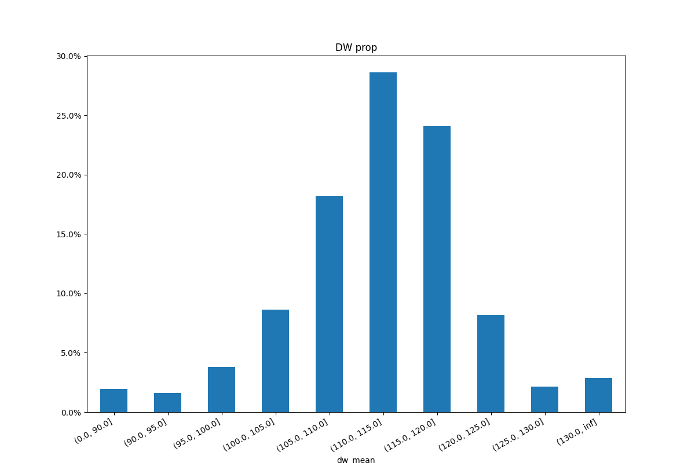

Fig 5-2-2 四种碱基DW占比图

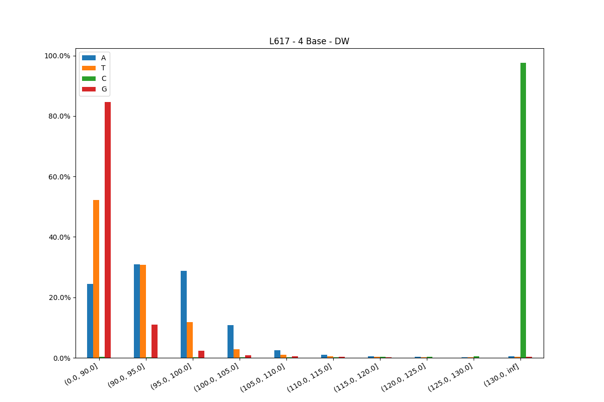

## 6. Capture Rate相关统计

### 6.1 与Block Rate的关系

Fig 6-1-1 CR与BR相关性散点图

### 6.2 CR分布

Fig 6-2-1 DW分布条形图

Fig 6-2-2 四种碱基CR占比图

## 7. Pore-LT与Basecall-LT相关统计

Fig 7-1 Pore-LT与Basecall-LT占比图

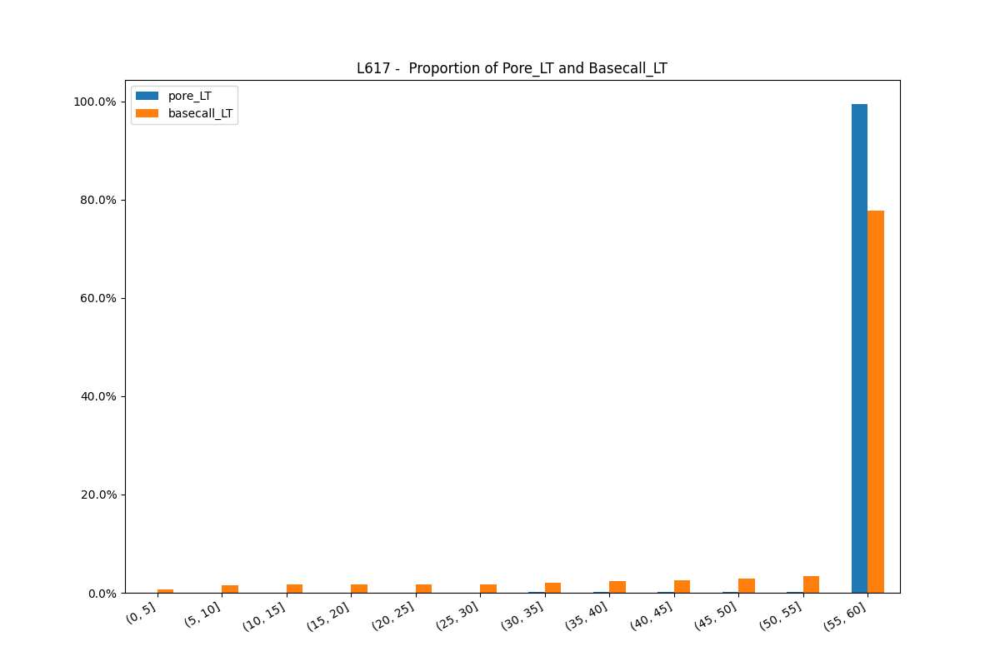
    